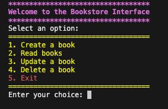

# Bookstore

> Bookstore is a simple command line interface CRUD application for managing a bookstore



To run the application in the command line:

```
python3 bookstore_interface.py
```                                                                                            